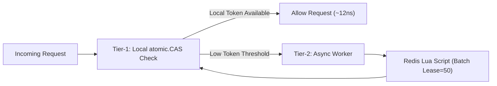
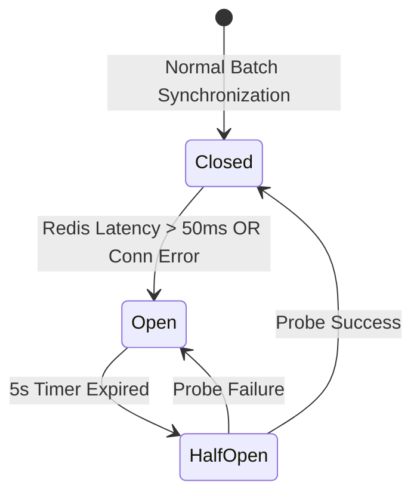
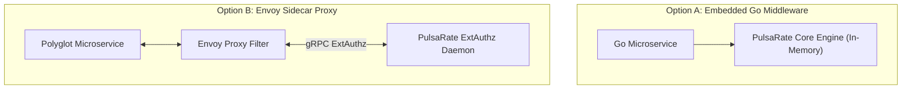

# Architecture Decision Records (ADRs): PulsaRate-Go
<!-- -------------------------------------------------------------------------------------------------------------------                                                                                                                                                                               #*eddiere -->

This document records the key architectural decisions, context, and rationale behind the design of **PulsaRate-Go**.

---

## ADR-001: 2-Tier Token Bucket with Local Atomic Leases (`sync/atomic`)

### Status
**Accepted**

### Context
Traditional distributed rate limiters execute a central Redis `EVAL` Lua script for every incoming request across microservice instances. At high volumes ($>100\text{k}$ RPS), this causes:
1. Severe Redis CPU saturation.
2. Network round-trip tail latency penalties ($p99 > 25\text{ms}$).
3. Single Point of Failure (SPOF) risks during traffic surges.

### Decision
We adopt a **Two-Tier Hybrid Architecture**:
* **Tier-1 (Local Reservoir):** Microservice instances evaluate incoming requests locally in CPU memory using lock-free `sync/atomic` primitives without acquiring OS locks or network IO.
* **Tier-2 (Global Synchronizer):** Background lease workers pre-reserve token blocks (e.g. 50 tokens per 50ms interval) from Redis using pipelined atomic Lua scripts.

### Consequences
* **Positive:** Reduces Redis network round-trips by up to 94–98%.
* **Positive:** Local decision latency drops to ~12ns per request with $0\text{ B/op}$ memory allocations.
* **Tradeoff:** Minor local quota drift (up to the batch lease size) during abrupt instance crashes, which is acceptable in high-throughput rate limiting.

---

## ADR-002: Circuit Breaker & Fail-Open/Fail-Closed Degradation Strategy

### Status
**Accepted**

### Context
If central Redis becomes unavailable, overloaded, or partitioned, standard distributed rate limiters fail completely (either blocking all traffic or crashing downstream services).

### Decision
Implement a Martin Fowler-inspired **Circuit Breaker** state machine inside the Tier-2 synchronizer:
* **Closed (Normal):** Async batch leases renew continuously from Redis.
* **Open (Redis Unreachable/Degraded):** If Redis response latency exceeds $50\text{ms}$ or error rate exceeds $5\%$, the circuit breaker opens.
* **Fallback Mode:** In Open state, instances fall back to an isolated local sliding-window limit to prevent client starvation while shielding downstream microservices from unthrottled surges.
* **Half-Open (Recovery):** Probes Redis with light health checks before resuming full batch synchronization.

### Consequences
* **Positive:** Microservices remain operational during Redis outages without catastrophic cascading failures.
* **Positive:** High availability and fault isolation.

---

## ADR-003: Multi-Interface Delivery (Go Middleware, Gin Plugin & Envoy ExtAuthz Sidecar)

### Status
**Accepted**

### Context
Users deploy rate limiters in diverse environments: some prefer embedding rate limiting inside Go monolithic/microservice code (`net/http` or Gin), while others require zero-code sidecar proxies (Envoy / Service Mesh).

### Decision
Decouple the core engine (`pkg/limiter`) from application delivery protocols:
1. Provide in-process Go middleware (`pkg/middleware/stdlib.go` & `gin.go`).
2. Provide a standalone Envoy gRPC External Authorization server (`pkg/middleware/extauthz.go`).

### Consequences
* **Positive:** Maximum flexibility across Go microservices and polyglot Kubernetes service meshes.
* **Positive:** Core rate-limiting logic is shared across all delivery wrappers.
