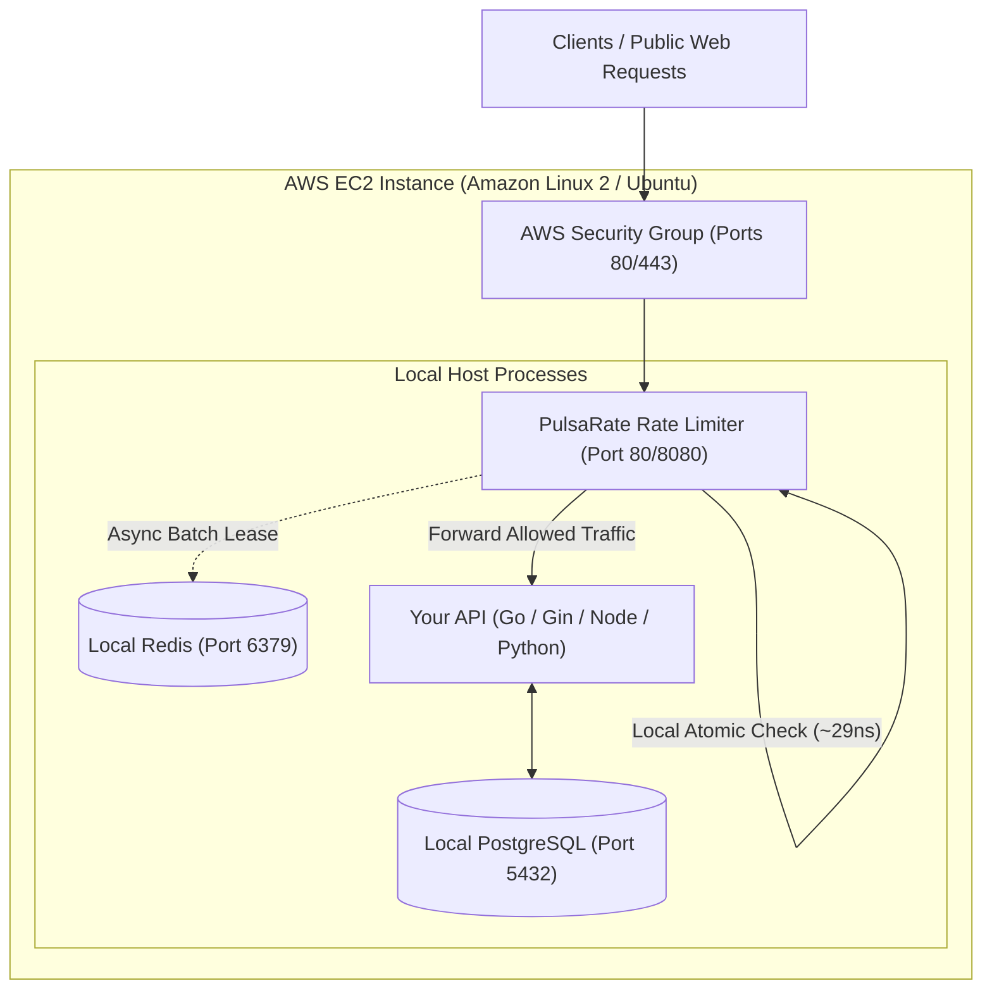
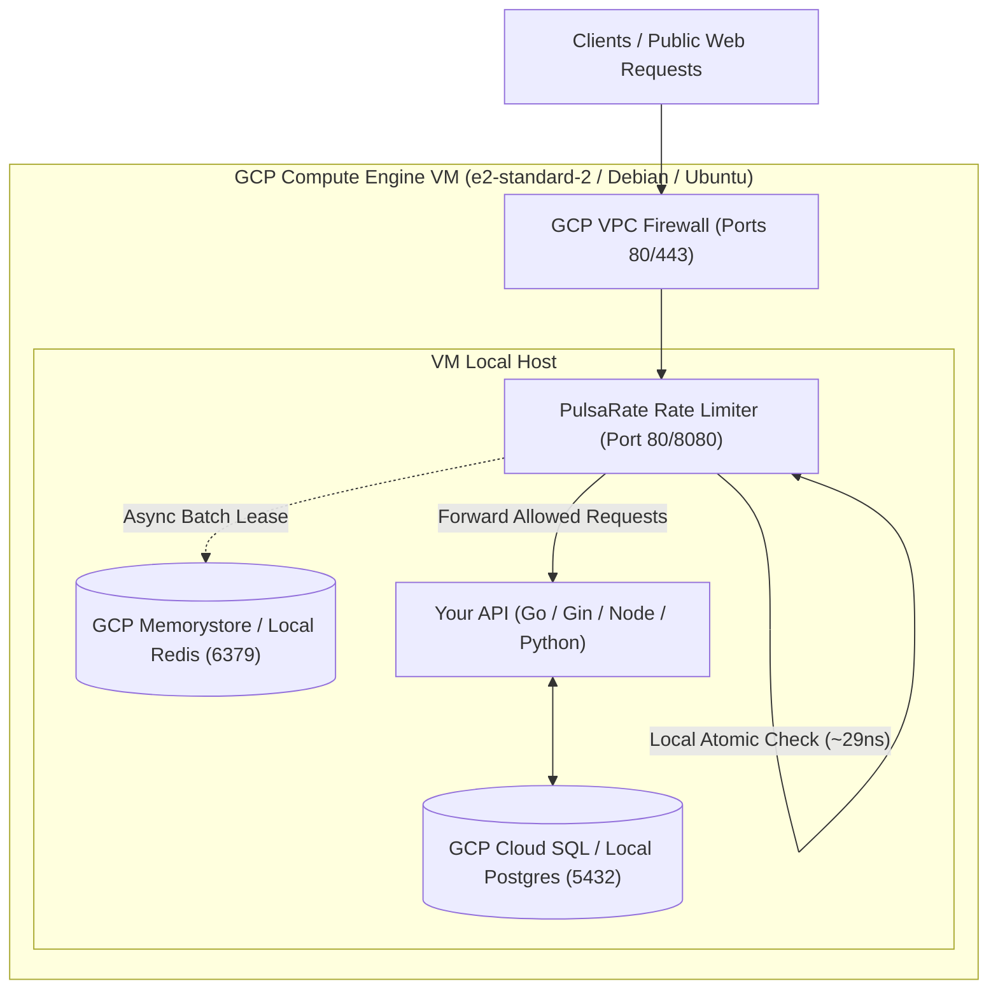

# Cloud Production Deployment Guide: PulsaRate-Go
<!-- -------------------------------------------------------------------------------------------------------------------                                                                                                                                                                               #*eddiere -->

This guide provides step-by-step production deployment instructions for **PulsaRate-Go** across **AWS EC2** and **Google Cloud Platform (GCP Compute Engine & GCP Cloud Run)** alongside **Redis**, **PostgreSQL**, and your **API**.

---

## 1. AWS EC2 Production Deployment

### Architecture Topology on AWS EC2



### Scenario A: Embedded Middleware on EC2 (Go / Gin)
If your API is written in Go or the **Gin Web Framework**, PulsaRate runs in-process inside your application binary with $0\text{ B/op}$ memory allocations:

```go
package main

import (
    "log"
    "github.com/gin-gonic/gin"
    "github.com/OscarEdem/PulsaRate-Go/pkg/limiter"
    "github.com/OscarEdem/PulsaRate-Go/pkg/middleware"
)

func main() {
    r := gin.Default()

    cfg := limiter.Config{
        Capacity:   100,
        RefillRate: 20,
        BatchSize:  25,
    }

    engine, err := limiter.NewEngine(cfg, nil)
    if err != nil {
        log.Fatalf("PulsaRate engine error: %v", err)
    }

    // Protect all routes with GinRateLimit middleware
    r.Use(middleware.GinRateLimit(engine))

    r.GET("/api/data", func(c *gin.Context) {
        c.JSON(200, gin.H{"status": "ok"})
    })

    log.Fatal(r.Run(":8080"))
}
```

### Scenario B: Standalone Reverse Proxy Guard on EC2
If your API is in Python, Node.js, or Java:
```bash
# Build binary on EC2
go build -o /usr/local/bin/pulsaim ./cmd/pulsaim
```
Configure `/etc/systemd/system/pulsarate.service`:
```ini
[Unit]
Description=PulsaRate Rate Limiting Sidecar Proxy
After=network.target redis.service

[Service]
Type=simple
User=ubuntu
ExecStart=/usr/local/bin/pulsaim
Restart=always

[Install]
WantedBy=multi-user.target
```
Enable and start service:
```bash
sudo systemctl daemon-reload && sudo systemctl enable --now pulsarate
```

---

## 2. Google Cloud Platform (GCP) Deployment

### Option A: GCP Compute Engine (VM Instance)



Deployment on GCP Compute Engine follows the same Systemd service pattern as EC2 above.

---

### Option B: GCP Cloud Run (Serverless Auto-Scaling Containers)

For serverless container deployment on Cloud Run:

#### Dockerfile
```dockerfile
FROM golang:1.22-alpine AS builder
WORKDIR /app
COPY go.mod go.sum ./
RUN go mod download
COPY . .
RUN CGO_ENABLED=0 GOOS=linux go build -o /pulsaim ./cmd/pulsaim

FROM alpine:latest
WORKDIR /root/
COPY --from=builder /pulsaim .
EXPOSE 8080
CMD ["./pulsaim"]
```

#### Deploy Command
```bash
# Build and deploy to GCP Cloud Run with Serverless VPC Connector to Memorystore Redis
gcloud builds submit --tag gcr.io/YOUR_PROJECT_ID/pulsarate-proxy:latest

gcloud run deploy pulsarate-proxy \
  --image gcr.io/YOUR_PROJECT_ID/pulsarate-proxy:latest \
  --platform managed \
  --region us-central1 \
  --allow-unauthenticated \
  --vpc-connector memorystore-vpc-connector \
  --set-env-vars REDIS_URL="10.0.0.3:6379"
```

---

## 3. Cloud Operational Benefits Summary

| Feature / Goal | AWS EC2 Deployment | GCP Cloud Run / GCE Deployment |
| :--- | :--- | :--- |
| **PostgreSQL Protection** | Prevents DB connection pool saturation | Protects GCP Cloud SQL connection limits |
| **Redis Efficiency** | Reduces Redis CPU load by 94%+ | Cuts GCP Memorystore billing operations by 94%+ |
| **Scaling Capability** | Scale via AWS Auto Scaling Groups (ASG) | Auto-scales serverless containers 0 to 1,000+ instances |
| **Decision Latency** | Sub-millisecond (~29ns CPU RAM) | Sub-millisecond (~29ns CPU RAM) |
