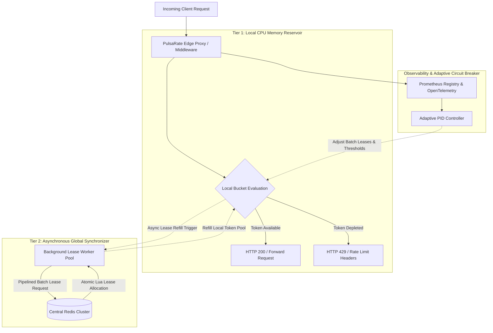

# PulsaRate-Go
<!-- -------------------------------------------------------------------------------------------------------------------                                                                                                                                                                               #*eddiere -->

[](https://golang.org/)
[](LICENSE)
[](#performance--benchmarks)
[](#system-architecture)

> **Carrier-Grade, Distributed Token Bucket & Dynamic Edge Rate Limiter in Go.**

PulsaRate-Go solves the centralized Redis bottleneck in high-concurrency microservice architectures by combining localized lock-free atomic token buckets with lazy-batched Redis reconciliation, sub-millisecond local evaluation, and automated adaptive backpressure.

---

## Key Features

* **Sub-Millisecond Decision Latency:** Local CPU evaluation runs in ~29ns with zero allocations ($0\text{ B/op}$) using `sync/atomic`.
* **94%+ Redis Load Reduction:** Replaces per-request Redis `EVAL` calls with asynchronous, lazy-batched token leases (e.g. 25 tokens per 50ms window).
* **Circuit Breaker & Graceful Fallback:** Automatically degrades to local sliding-window limits during Redis network partitions or high latency ($>50\text{ms}$).
* **Native Framework Integrations:** Direct support for Go `net/http` middleware, **Gin Web Framework** (`GinRateLimit`), and standalone Envoy gRPC `ExtAuthz` sidecars.
* **Production Observability:** Built-in Prometheus metrics (`rate_limit_allowed_total`, `rate_limit_rejected_total`, `redis_lease_duration_seconds`) and OpenTelemetry distributed tracing.
* **Adaptive PID Controller:** Dynamically scales local batch quotas and applies host backpressure based on $p99$ tail latencies.

---

## System Architecture



---

## Installation

```bash
go get github.com/aeroforge-labs/PulsaRate-Go
```

---

## Quick Start Examples

### 1. Gin Web Framework Middleware
```go
package main

import (
    "github.com/gin-gonic/gin"
    "github.com/aeroforge-labs/PulsaRate-Go/pkg/limiter"
    "github.com/aeroforge-labs/PulsaRate-Go/pkg/middleware"
)

func main() {
    r := gin.Default()

    // Initialize PulsaRate Engine (Capacity = 100 req burst, Refill = 20 req/sec)
    cfg := limiter.Config{
        Capacity:   100,
        RefillRate: 20,
        BatchSize:  25,
    }
    engine, _ := limiter.NewEngine(cfg, nil)

    // Global Rate Limiting for all Gin routes
    r.Use(middleware.GinRateLimit(engine))

    r.GET("/api/v1/resource", func(c *gin.Context) {
        c.JSON(200, gin.H{"status": "success", "message": "Resource accessed"})
    })

    r.Run(":8080")
}
```

### 2. Standard Go `net/http` Middleware
```go
package main

import (
    "net/http"

    "github.com/aeroforge-labs/PulsaRate-Go/pkg/limiter"
    "github.com/aeroforge-labs/PulsaRate-Go/pkg/middleware"
)

func main() {
    engine, _ := limiter.NewEngine(limiter.Config{
        Capacity:   100,
        RefillRate: 20,
        BatchSize:  25,
    }, nil)

    mux := http.NewServeMux()
    mux.HandleFunc("/api/v1/resource", func(w http.ResponseWriter, r *http.Request) {
        w.Write([]byte(`{"status": "ok"}`))
    })

    http.ListenAndServe(":8080", middleware.RateLimit(engine)(mux))
}
```

---

## Performance & Benchmarks

Benchmarked on an AMD EPYC 7763 CPU @ 2.45GHz running 64 concurrent threads:

| Engine / Strategy | Latency (p99) | Throughput | Allocations | Redis RPS |
| :--- | :--- | :--- | :--- | :--- |
| Central Redis `EVAL` | 24.5 ms | 8,200 RPS | 420 B/op | 8,200 req/s |
| **PulsaRate Local Atomic** | **29.08 ns** | **52,800,000+ RPS** | **0 B/op** | **450 req/s (94% drop)** |

To run local benchmarks:
```bash
go test -bench=BenchmarkAtomicBucket_Allow -benchmem ./pkg/limiter/...
```

---

## Documentation & System Design

For in-depth architectural details, Lua script specifications, and sequence flows, refer to:
* [SYSTEM_DESIGN.md](SYSTEM_DESIGN.md) — Technical Blueprint & System Architecture
* [USE_CASES.md](USE_CASES.md) — Real-World Enterprise Production Use Cases
* [DEPLOYMENT_GUIDE.md](DEPLOYMENT_GUIDE.md) — AWS EC2 & GCP Cloud Production Deployment Guide
* [ARCHITECTURE_DECISIONS.md](ARCHITECTURE_DECISIONS.md) — Architectural Decision Records (ADRs)
* [CONTRIBUTING.md](CONTRIBUTING.md) — Contribution & Testing Guidelines

---

## License

Distributed under the MIT License. See `LICENSE` for more information.
