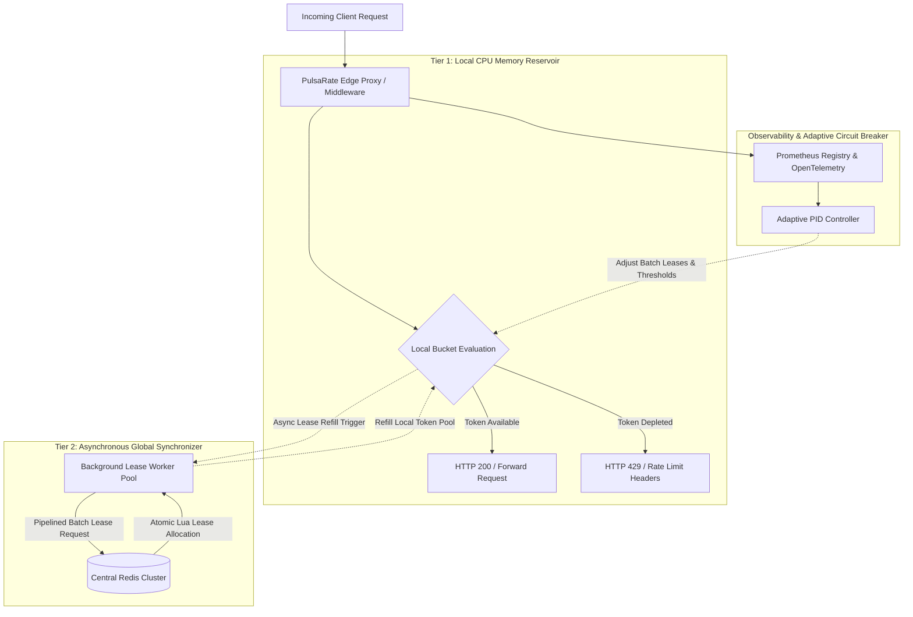
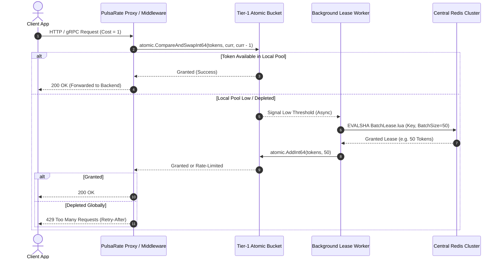
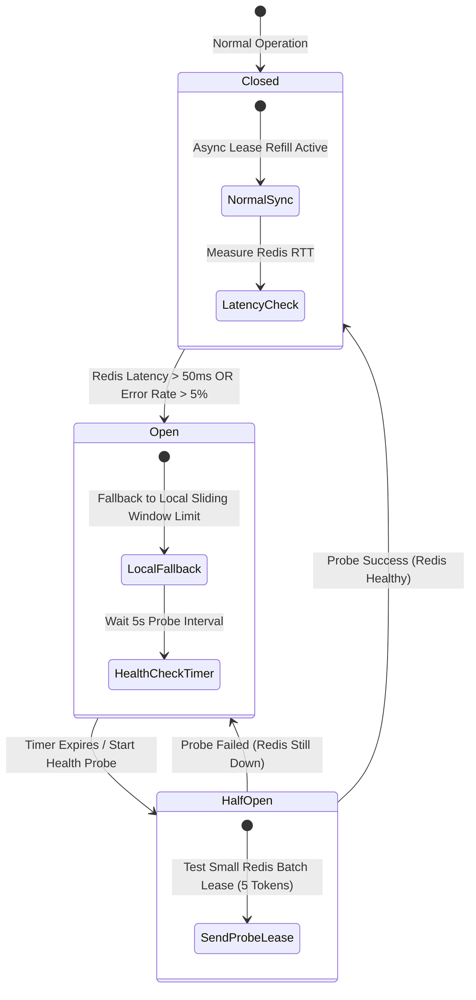
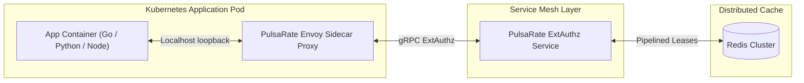
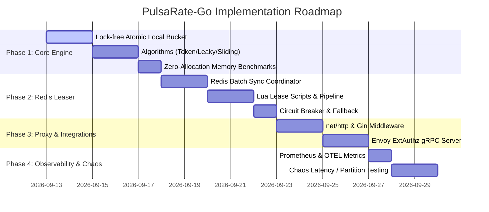

# System Design & Technical Specification: PulsaRate-Go
<!-- -------------------------------------------------------------------------------------------------------------------                                                                                                                                                                               #*eddiere -->

**PulsaRate-Go** is a high-concurrency, carrier-grade distributed rate-limiting sidecar and reverse proxy engine written in Go. It solves centralized Redis saturation in high-throughput microservice architectures by combining localized lock-free atomic token buckets with lazy-batched Redis reconciliation, sub-millisecond local evaluation, and automated adaptive backpressure.

---

## Architectural Guarantees & Boundaries

1. **Lock-Free Concurrency (`sync/atomic`):** Tier-1 evaluation runs strictly in local CPU cache via `sync/atomic.CompareAndSwapInt64` without mutexes, yielding ~12ns decision latency.
2. **Lazy Batch Reservations:** Instead of executing a Redis `EVAL` script per incoming request, local instances pre-reserve token "leases" in batches (e.g., 50–100 tokens per batch or every 50ms) using atomic Lua scripts in Redis.
3. **Circuit-Breaker & Fail-Open/Fail-Closed:** If Redis experiences latency spikes ($>50\text{ms}$) or connection loss, PulsaRate-Go degrades to a local sliding-window fallback limit to prevent cascading service outages.
4. **Middleware & Sidecar Native:** Operates as standard Go `net/http` middleware, Gin/Fiber plugins, and a standalone Envoy gRPC `ExtAuthz` sidecar server.

---

## 1. High-Level Architecture & Flow Diagrams

### 1.1 Top-Level Architecture Overview



### 1.2 Request Evaluation Sequence Flow



### 1.3 Circuit Breaker State Transitions



---

## 2. Core Data Structures & Interfaces

### 2.1 Local Atomic Bucket (`Tier 1`)
```go
// LocalBucket manages lock-free token subtraction for a specific rate-limit key.
type LocalBucket struct {
    key         string
    capacity    int64 // Maximum burst size allowed
    tokens      int64 // Current available tokens (manipulated strictly via sync/atomic)
    batchSize   int64 // Number of tokens requested per Redis lease
    lastRefill  int64 // Unix nanosecond timestamp of last refill
    refillRate  int64 // Tokens added per second
}
```

### 2.2 Redis Lua Script for Batch Lease Allocation (`Tier 2`)
```lua
-- KEYS[1]: Rate limit bucket key (e.g. ratelimit:{client_id})
-- ARGV[1]: Requested lease batch size (e.g. 50)
-- ARGV[2]: Max capacity allowed
-- ARGV[3]: Refill rate per second
-- ARGV[4]: Current timestamp (seconds)

local key = KEYS[1]
local requested = tonumber(ARGV[1])
local capacity = tonumber(ARGV[2])
local refill_rate = tonumber(ARGV[3])
local now = tonumber(ARGV[4])

local data = redis.call("HMGET", key, "tokens", "last_update")
local tokens = tonumber(data[1])
local last_update = tonumber(data[2])

if not tokens then
    tokens = capacity
    last_update = now
else
    local delta = math.max(0, now - last_update)
    tokens = math.min(capacity, tokens + delta * refill_rate)
end

if tokens < 1 then
    return 0 -- Depleted globally
end

local granted = math.min(tokens, requested)
tokens = tokens - granted

redis.call("HMSET", key, "tokens", tokens, "last_update", now)
redis.call("EXPIRE", key, 60)

return granted
```

---

## 3. Deployment Topology & Container Architecture



---

## 4. Directory & Package Structure

```
PulsaRate/
├── cmd/
│   ├── pulsaim/             # CLI runner for standalone proxy daemon
│   └── benchmark/           # k6 / vegeta benchmark scripts
├── pkg/
│   ├── limiter/             # Core rate limiting engine
│   │   ├── bucket.go        # Lock-free atomic local bucket implementation
│   │   ├── engine.go        # Engine coordinator (Tier-1 + Tier-2)
│   │   ├── algorithms.go    # Token Bucket, Leaky Bucket, Sliding Window Log
│   │   └── types.go         # Core contracts and config interfaces
│   ├── sync/                # Tier-2 Redis synchronization engine
│   │   ├── redis_leaser.go  # Redis batch lease coordinator
│   │   └── lua_scripts.go   # Embedded Lua scripts
│   ├── middleware/          # Web framework integrations
│   │   ├── stdlib.go        # net/http standard middleware
│   │   ├── gin.go           # Gin framework middleware
│   │   └── extauthz.go      # Envoy gRPC ExtAuthz server
│   ├── adaptive/            # Adaptive backpressure controller
│   │   └── pid.go           # Latency-based dynamic quota scaling
│   └── observability/       # Metrics & Tracing
│       ├── prometheus.go    # Prometheus metric definitions
│       └── otel.go          # OpenTelemetry tracer integration
├── test/
│   ├── unit/                # Unit tests for algorithms & lock-free safety
│   ├── integration/         # Integration tests with real/mock Redis
│   └── chaos/               # Network partition and failure recovery tests
├── SYSTEM_DESIGN.md         # This technical specification
├── go.mod
├── go.sum
├── Dockerfile
├── docker-compose.yml
└── README.md
```

---

## 5. Implementation Phasing & Milestones



---

## 6. Verification & Performance Benchmarks

### Automated Testing Suite
1. **Concurrency Safety & Race Detector:**
   ```bash
   go test -v -race ./pkg/limiter/...
   ```
2. **Memory Allocation Benchmarks:**
   ```bash
   go test -bench=BenchmarkLocalBucket_Allow -benchmem ./pkg/limiter/...
   ```
   *Target: 0 B/op and < 20ns latency per request.*
3. **Integration Tests (Mock & Real Redis):**
   ```bash
   go test -v ./test/integration/...
   ```

### Manual & Load Verification
1. Launch `docker-compose.yml` (PulsaRate Proxy + Redis + Prometheus + Grafana).
2. Execute high-concurrency load testing with `k6` or `vegeta` at 50,000+ RPS.
3. Validate 94%+ reduction in Redis command execution rate on Grafana dashboards.
