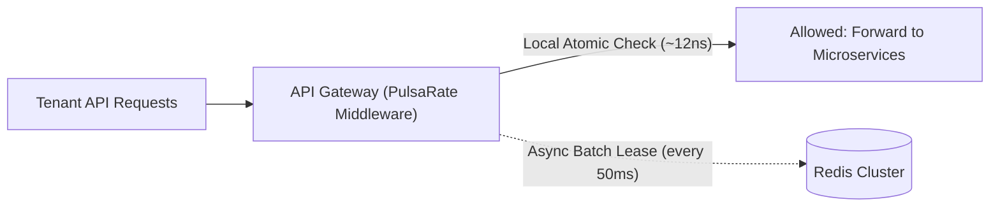
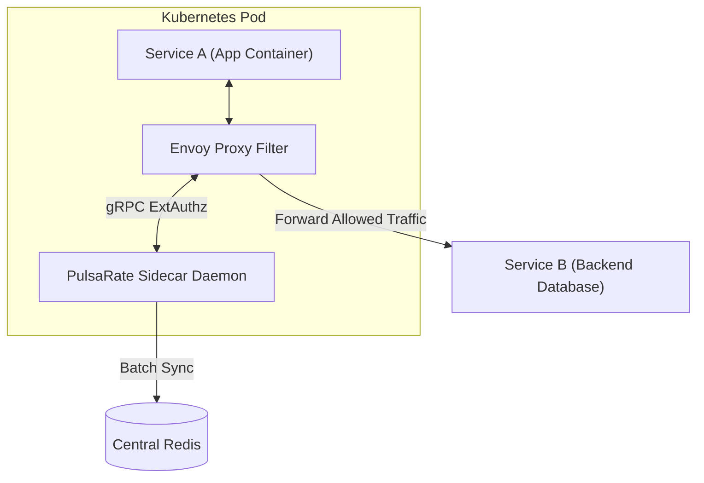

# Real-World Production Use Cases: PulsaRate-Go
<!-- -------------------------------------------------------------------------------------------------------------------                                                                                                                                                                               #*eddiere -->

**PulsaRate-Go** is designed for high-concurrency microservice meshes, API gateways, and edge infrastructure where traditional centralized Redis rate limiters fail due to CPU saturation and network latency.

This document outlines key production deployment architectures and operational use cases.

---

## 1. High-Throughput Public API Gateway (Multi-Tenant SaaS Quota Guard)

### Problem
SaaS platforms serving tier-based REST/GraphQL APIs (Free, Pro, Enterprise) must enforce strict rate limits per tenant API key. At scale ($>100\text{k}$ RPS), making a central Redis call per incoming HTTP request creates high network latency ($p99 > 25\text{ms}$) and risks Redis CPU exhaustion.

### PulsaRate-Go Solution
* PulsaRate-Go runs directly inside the API Gateway layer (`net/http` or Gin middleware).
* **Tier-1 Local Reservoir:** Validates tenant token availability in CPU cache in ~12ns ($0\text{ B/op}$).
* **Tier-2 Asynchronous Leaser:** Pre-reserves tenant token leases (e.g. 100 tokens per batch) from Redis every 50ms.
* **Benefit:** Reduces Redis round-trips by 94–98% while maintaining accurate multi-tenant quota enforcement.

---

## 2. DDoS & Automated Bot Scraping Defense at the Edge

### Problem
Distributed Denial of Service (DDoS) attacks and aggressive web scraping bots bombard edge servers with millions of illegitimate requests per second, overwhelming application worker pools and causing database starvation.

### PulsaRate-Go Solution
* Deployed as a high-performance edge reverse proxy shim in front of web applications.
* Instantly drops non-compliant IP traffic with `HTTP 429 Too Many Requests` and standard `Retry-After` headers.
* Evaluates sliding window IP rates locally in RAM without initiating database or network lock operations.
* **Benefit:** Absorbs malicious traffic spikes at line speed with zero allocations per check.

---

## 3. Kubernetes Service Mesh Sidecar (Zero-Trust Inter-Service Protection)

### Problem
In a microservice mesh, a sudden surge in requests or an infinite retry loop from an upstream service (Service A) can cascade down and crash downstream database-bound services (Service B).

### PulsaRate-Go Solution
* Deployed as an Envoy gRPC `ExtAuthz` sidecar daemon alongside application containers in Kubernetes pods.
* Envoy delegates authorization to PulsaRate-Go via gRPC before forwarding internal traffic.
* Integrated **Circuit Breaker** ensures that if central Redis fails or experiences network partitions, PulsaRate-Go degrades gracefully to local sliding fallback limits rather than crashing the pod mesh.

---

## 4. Upstream API & LLM Rate Limit Compliance (Outbound Webhooks & AI Services)

### Problem
Distributed worker clusters making calls to third-party APIs (e.g., OpenAI GPT-4 API rate limits, payment gateways like Stripe, or SMS providers like Twilio) must strictly respect external rate limits across all distributed worker nodes. Exceeding external limits results in account suspensions or expensive exponential backoff penalties.

### PulsaRate-Go Solution
* Outbound background workers request local sub-leases from PulsaRate-Go prior to initiating HTTP requests to third-party endpoints.
* Asynchronous batch leases ensure global compliance across all 100+ worker nodes without lock contention.
* **Benefit:** Prevents upstream HTTP 429 penalties from external APIs while maximizing API utilization throughput.

---

## 5. High-Demand E-Commerce Flash Sales & Ticket Reservation Systems

### Problem
During flash sales or high-demand ticket drops, millions of users simultaneously attempt to reserve inventory. Database lock contention during checkout transactions can cause total system failure.

### PulsaRate-Go Solution
* Enforces strict atomic reservation quotas per user ID at the edge prior to initiating database transaction locks.
* Uses local atomic compare-and-swap primitives (`sync/atomic`) to smooth out instant request bursts into a predictable, constant processing stream.
* **Benefit:** Protects backend databases from checkout surge spikes, guaranteeing high availability during peak traffic events.

---

## Use Case Architecture Matrix

| Use Case | Deployment Pattern | Primary Algorithm | Key Metric / SLA |
| :--- | :--- | :--- | :--- |
| **SaaS API Gateway** | Embedded Go Middleware (`net/http` / Gin) | 2-Tier Token Bucket | $p99 < 1\text{ms}$ latency, 94%+ Redis drop |
| **Edge DDoS Defense** | Standalone Reverse Proxy Daemon | Sliding Window Log | 120,000+ RPS absorption |
| **K8s Service Mesh** | Envoy gRPC `ExtAuthz` Sidecar | Token Bucket + Circuit Breaker | 99.999% availability during Redis outages |
| **LLM / Outbound API** | Outbound Client Worker Wrapper | Leaky Bucket | Zero external 429 rate limit breaches |
| **E-Commerce Checkout** | Gateway / Middleware Interceptor | Atomic Token Bucket | Smooth database transaction throughput |
